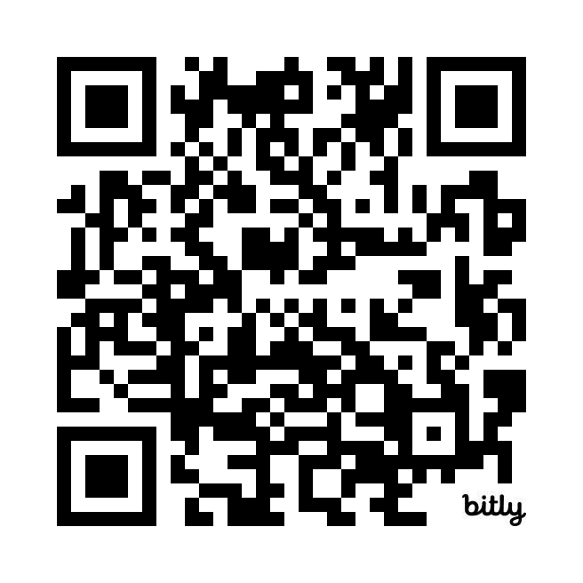

<!-- headingDivider: 1 -->
<!-- backgroundColor: black -->
<!-- class: invert -->

# Welcome

# Lesson 0.1

Welcome to Python I Programming Honors!



# Agenda

- Policies & Procedures
- Setting up

# Using Artificial Intelligence

- AI is great for learning but, since the typical student uses it for "Getting the Job Done", using AI is prohibited during class and blocked through DyKnow
- Expect to be asked about your code - if you don't understand what you wrote, you won't get full credit for it
- You are encouraged to use AI **outside of class** and **for learning**

# Assignments and grades

- Prepare: About 2 per week, 18 per quarter
  - CodeHS assignments and various extra coding challenges
- Rehearse: Unit Quizzes, about 1 per week, 9 per quarter
  - Coding challenges to be completed in class
- Perform: Unit Exams, about 4 per quarter

# Late Work

- Automatic 0 for missing work
- Minimum 50 for attempted work per district policy
- 3 points automatically deducted for each day late including weekends
- Late submissions will remain a 0 until I grade it; don't expect me to grade it immediately

# Platforms / Software

- [Course Website](https://whlapinel.github.io/python/courses/courses.html) - all slides, files and assignment instructions
- Canvas - where all assignments will be submitted
- Powerschool - ultimate authority on grades (nightly sync enabled)
- Python
- VS Code
- PowerShell
- Online GDB
- CodeHS

# Rules & Procedures

- No personal devices during class
- Absolutely, positively no food or drink in the classroom
- AFTER you finish work you may eat a snack in the break room - you must clean up after yourself!
- Bathroom
  - after first 15, before last 15
  - not while I'm talking to the class
  - ask for permission and if I give it, you will write yourself a pass and show it to me

# Materials

- Flash drive is not required but would be good for you to have, does not need a lot of storage
- OneDrive has not been reliable on this network because access is intermittent (ongoing issue)
- If you can't get a flash drive, you can upload files to your google drive at the end of each class

# Getting the right mentality

1. Programming is hard
2. This is an "honors" course, and I will be challenging you
3. Be patient and persevere
4. Seek to understand the underlying process, not simply to know the steps
5. Seek help from classmates
6. Seek to help your classmates (when they are seeking help!)
7. Own the bug: it's not the computer's fault; there's something wrong with your code
8. Get plenty of sleep and come in fully alert and engaged
9. Practice, experiment, and play

# Let's Get Signed into CodeHS

Click here: [Join Class](https://codehs.com/go/2624F)

# Python 1: Introduction to Programming

# Welcome to Python Programming!

- **What is programming?**
  - Giving instructions to a computer to perform tasks.
  
- **Why Python?**
  - Easy to learn and read.
  - Widely used in web development, data science, AI, and more.

# What You’ll Learn
1. Basic syntax and concepts.
2. Writing your first Python program.
3. Problem-solving using Python.

# Meet Python
- **High-level language**: Easy to understand.
- **Interpreted**: Runs your code line by line.
- **Popular**: Used EVERYWHERE.

# Tools You'll Need
1. A computer.
2. Python installed (Version 3.x).
3. An editor like VS Code, or just use IDLE (comes with Python).

# Writing Your First Program
1. Open your Python editor.
2. Type:
   ```python
   print("Hello, world!")
   ```
3. Run the program to see the output.

# Understanding the Code

- `print()`: A function to display text on the screen.
- `"Hello, world!"`: A string (text data) inside quotes.

# Programming is Like Solving Puzzles
- Break big problems into small steps.
- Write clear instructions to solve each step.

# Python Syntax: The Basics
1. **Variables**: Storing data.
   ```python
   name = "Alice"
   age = 12
   ```

# 2. **Data types**:
- Strings: Text ("Alice")
- Numbers: Integers (12), Floats (12.5)
- Booleans: True or False

# 3. **Comments**: Explain your code.
   ```python
   # This is a comment
   ```
# Let’s Practice: Variables
Write a program that:
1. Stores your name in a variable.
2. Stores your age in another variable.
3. Prints: `My name is [name] and I am [age] years old.`

# Next Steps
- Learn to use **input()** for user interaction.
- Work with **if statements** for decision-making.
- Explore loops to repeat actions.
